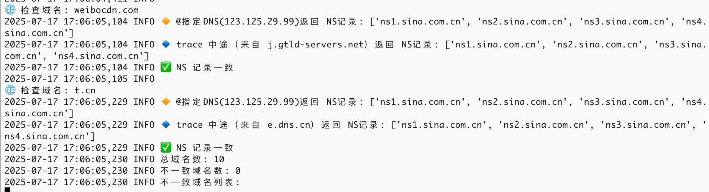
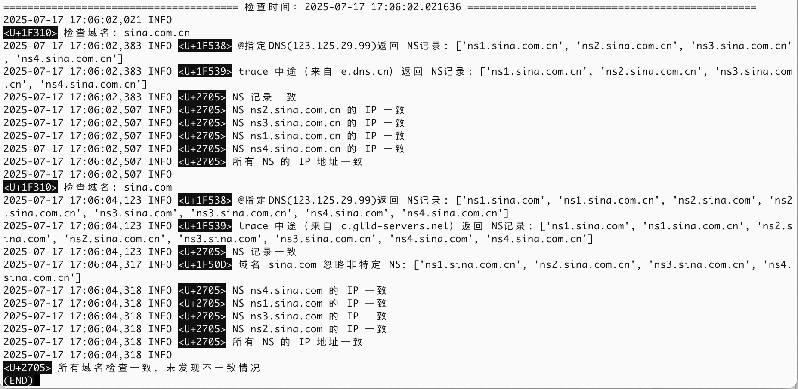
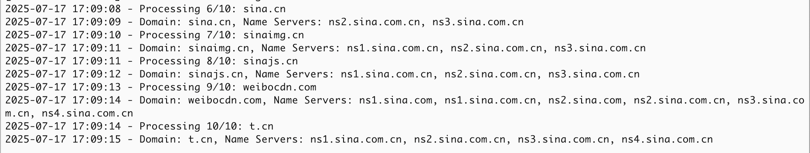

# devops

描述：

运行：
# NS check
*/3 * * * * cd /data0/nscheck && python3 dns-ns.py

# NS ip check
*/3 * * * * cd /data0/nscheck && python3 dns-ip.py

# whois NS
*/3 * * * * cd /data0/nscheck && python3 dns-whois.py

